<!--
i18n/en/README.md
@guterion
CC-BY-SA-4.0
Profile page in English
-->

 **[Latine](../la/README.md)** ·  **[Español](../es/README.md)** ·  **English**

# 𝕱𝖗𝖆𝖓𝖈𝖔 𝕲𝖚𝖙𝖎𝖊́𝖗𝖗𝖊𝖟

**Computer Science and Engineering student at the University of Chile (DCC/FCFM).**

*Focused on systems, open source, Unix-like systems, and software engineering.*

📍 Santiago, Chile

---

## About

I'm Franco Gutiérrez. I study Computer Science and Engineering at the
**University of Chile**, in the Department of Computer Science
(**DCC**) of the Faculty of Physical and Mathematical Sciences
(**FCFM**).

My main interests are systems, free and open-source software,
Unix-like operating systems, and software engineering. I tend to work
from the shell, primarily with **Neovim**.

## Currently

My studies at the [**University of Chile**](https://uchile.cl/) are my
primary focus, alongside personal software projects and my work at
[**Venturas**](https://venturas.cl/).

## University

<table>
<tr><td><b>Degree</b></td><td>Computer Science and Engineering</td></tr>
<tr><td><b>Department</b></td><td>Department of Computer Science (DCC)</td></tr>
<tr><td><b>Faculty</b></td><td>Faculty of Physical and Mathematical Sciences (FCFM)</td></tr>
<tr><td><b>University</b></td><td>University of Chile</td></tr>
</table>

## Computing

<table>
<tr><td><b>Editor</b></td><td>Neovim</td></tr>
<tr><td><b>Systems</b></td><td>GNU/Linux, BSD</td></tr>
<tr><td><b>Working with</b></td><td>C, Python, Scala, Kotlin</td></tr>
<tr><td><b>Web &amp; markup</b></td><td>HTML, CSS, JavaScript, Markdown</td></tr>
</table>

## Projects

<table>
<tr>
<td width="96" align="center"></td>
<td>
<b>gentoo-musl-install-guide</b> 
Advanced Gentoo installation documentation for AMD64 musl systems, covering
OpenRC, LUKS2, Btrfs, LLVM/Clang, ThinLTO, and the Zen kernel. 
<a href="https://github.com/guterion/gentoo-musl-install-guide"><b>guterion/gentoo-musl-install-guide &rarr;</b></a>
</td>
</tr>
<tr>
<td width="96" align="center"></td>
<td>
<b>phosphor</b> 
A terminal colour palette on a warm neutral ramp, as Base16 and Base24
schemes, in seventeen variants. 
<a href="https://github.com/guterion/phosphor"><b>guterion/phosphor &rarr;</b></a>
</td>
</tr>
</table>

[**All public repositories →**](https://github.com/guterion?tab=repositories)

## Enterprises

<table>
<tr>
<td width="96" align="center"></td>
<td>
<b>Venturas</b> 
Where I keep my commercial projects. 
<a href="https://venturas.cl/"><b>venturas.cl &rarr;</b></a>
</td>
</tr>
</table>

## Contact

<table>
<tr>
<td></td>
<td><a href="mailto:franco.gutierrez.1@ug.uchile.cl">franco.gutierrez.1@ug.uchile.cl</a></td>
</tr>
<tr>
<td></td>
<td><code>83EB 6096 ECF3 75F4 1E08&nbsp; 4AFA 464F 905B 27A2 BA82</code></td>
</tr>
<tr>
<td></td>
<td><a href="https://orcid.org/0009-0000-3485-5937" aria-label="View ORCID record - 0009-0000-3485-5937">0009-0000-3485-5937</a></td>
</tr>
<tr>
<td></td>
<td><a href="https://www.linkedin.com/in/guterion">linkedin.com/in/guterion</a></td>
</tr>
<tr>
<td></td>
<td><a href="https://x.com/guterion">x.com/guterion</a></td>
</tr>
</table>

Email is the best way to reach me. I answer as soon as I can.

## Support

You can support my public work through Liberapay or cryptocurrency. <b>Monero preferred.</b>

 

<table>
<tr>
<td></td>
<td><a href="https://liberapay.com/guterion/">liberapay.com/guterion</a></td>
</tr>
<tr>
<td></td>
<td><pre>48okbGH4M5HNhaSEyVTYqAQu8cLK6D9PmAWKRwCeyYx9RsFcbpjhnP5WaYoQYPwPNWS49xwqHsPrfP8U5zKmFoUYTrF6NNL</pre></td>
</tr>
<tr>
<td></td>
<td><pre>guterion@cake.cash</pre></td>
</tr>
<tr>
<td></td>
<td><pre>0xe9D6A00754FF22B092A7e9bC1b397517c2281291</pre></td>
</tr>
</table>

The Ethereum address takes ETH, USDC and USDT on Ethereum itself too.

<table>
<tr>
<td align="center"></td>
<td align="center"></td>
<td align="center"></td>
</tr>
<tr>
<td align="center"><b>Monero</b></td>
<td align="center"><b>Bitcoin</b></td>
<td align="center"><b>Ethereum</b></td>
</tr>
</table>

<a href="https://institutonacional.cl/">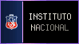</a> <a href="https://www.uchile.cl/">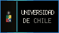</a> <a href="https://ingenieria.uchile.cl/">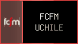</a> <a href="https://www.dcc.uchile.cl/">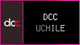</a> <a href="https://www.linux.org/">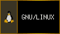</a>  <a href="https://www.openbsd.org/">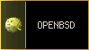</a>

<a href="https://magicant.github.io/yash/">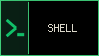</a>     <a href="https://www.minecraft.net/">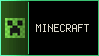</a> <a href="https://es.dragon-ball-official.com/">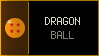</a>

<a href="https://www.thelatinlibrary.com/">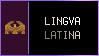</a> <a href="https://www.santiagoturismo.cl/">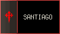</a> <a href="https://www.marcachile.cl/">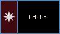</a> <a href="https://laroja.cl/">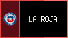</a> <a href="https://www.sslazio.it/">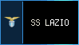</a>  <a href="https://www.linkinpark.com/">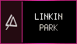</a>

---

Stats

 

